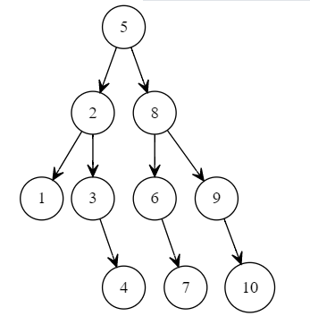
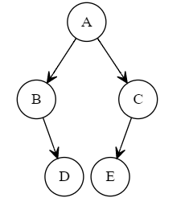
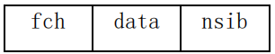
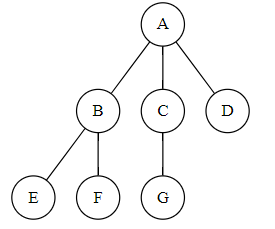

# 2010

## 一. 简答问题

1. 简述字符串,栈属于线性表的原因.

   >字符串是一种特定的线性表，其特殊性就在于组成线性表的每个元素就是一个单字符。
   >栈是一种限定性线性表，是将线性表的插入和删除操作限制为仅在表的一端进行。

2. 线性结构与非线性结构的差别.

   >线性结构中结点间具有唯一前驱、唯一后继关系，
   >而非线性结构中结点间前驱、后继的关系并不具有唯一性。

3. 算法定义与算法特性.

   >算法是规则的有限集合，是为解决特定问题而规定的一系列操作。
   >有限性,确定性,可行性,输入,输出。

4. 数据结构与抽象数据类型.

   >数据类型是一组性质相同的值集合以及定义在这个值集合上的一组操作的总称。抽象数据
   >类型（`ADT`)定义了一个数据对象、数据对象中各元表间的结构关系以及一组处理数据的操作。

5. 图遍历中设置访问标志数组的作用.

   >为了保证图中的各顶点在遍历过程中访问且仅访问一次，需要为每个顶点设一个访问标志，
   >因此要为图设置一个访问标志数组，用于标示图中每个顶点是否被访问过。

## 二.方法选择

1. 说明稳定排序含义，并给出一种不稳定排序方法的名称与证明。

   >假设在待排序的序列中存在多个相同关键字的记录。设$K_i=K_j$($1 \leq i \leq n,1 \leq j \leq n,i \neq j$),
   >若在排序前的序列中$R_i$领先于$R_j$(即$i<j$),经过排序后得到的序列中$R_i$仍领先于$R_j$,则称所用的排序方法是稳定的。
   >不稳定的排序举例:希尔排序$\left\{2,4,1,2^*\right\}$ 快速排序$\left\{3,3^*,2\right\}$
   >堆排序$\left\{5,5^*,3\right\}$

2. 在一个连通无向图上，欲求从一点$V_{i}$到另一点$V_{j}$($V_{i}!=V_{j}$)所经结点数目短路径，在深度优先搜索、广度优先搜索、从一点到其余各顶点的最短路径算法中，你认为最好选择哪种方法为基础，简述原因.

   >所经结点数目最少，选择广度优先搜索
   >所经结点最短路径选择从一点到其余各顶点的最短路径算法。

## 三.构造结果

1. 构造 10 个结点的折半判定树，并计算查找成功的平均查找长度。
   

   >$ASL=(1+2\times2+3\times4+4\times3)\div10=29\div10=2.9$

2. 已知一二叉树中序序列为 `BDAEC`，后序序列为 `DBECA`，给出其对应的二叉树。

   >

3. 已知 n 阶下三角矩阵 A（即当 $i<j$ 时，有( $a_{ij}=0$)，按照压缩存储的思想，可以将主对角线以下所有元素（包括主对角线上的元素）依次存放于一维数组B中。请从第一列开始，采用行序为主序，给出在 B 中确定元素$a_{ij}$存放位置的公式。

   >下三角矩阵是下三角不为0  
   >$LOC[i,j]=LOC[1,1]+[(i\times(i-1))\div2+j-1]\times size$

4. 二叉排序树采用二叉链表方式存放，树中结点值各不相同，欲得到一个由小到大的结点值递增序列，简述处理方法思路。

   >根据二叉排序树的定义(左子树小于根节点， 根节点小于右子树)，根据中序遍历的定义
   >(先中序遍历左子树，访问根节点，再中序遍历右子树)可以得出二叉排序树的一个重要性质，即中序遍历一个二叉排序树可以得到一个递增有序序列。

5. 给出求 N 阶 `hanoi` 塔的函数定义如下：

   ```c
   hanoi( int n, char x, char y, char z )
   {
      if ( n == 1 )
         move( x, 1, z );
      else{
         hanoi( n - 1, x, z, y )
         move( x, n, z );
         hanoi( n - 1, y, x, z );
      }
   }
   ```

请写出执行 `hanoi(3,a,b,c)` 时递归函数的实在参量变化及 move 的搬动过程。

   >**见`hanoi.cpp`**

   ```c
      hanoi(3,a,b,c)
         hanoi(2,a,c,b)
            hanoi(1,a,b,c)
                  move(a,1,c)
            move(a,2,b)
            hanoi(1,c,a,b)
                  move(c,1,b)
         move(a,3,c)
         hanoi(2,b,a,c)
            hanoi(1,b,c,a)
                  move(b,1,a)
            move(b,2,c)
            hanoi(1,a,b,c)
                  move(a,1,c)
   ```

## 四.编写程序

1. 要求实现如下功能：将数组 `C[1:n]`中所有奇数移到偶数之前，要求时间复杂度为 O(n)。

   ```c
   void move(int C[],int len)
   {
      int i = 0;//i表示左端偶数元素的下标
      int j = len-1;////j表示右端奇数元素的下标
      while (i < j)
      {
         while (i < j && (C[i] % 2 != 0)) //从前向后找到一个偶数元素
               i++;
         while (i < j && (C[j] % 2 != 1)) //从后向前找到一个奇数元素
               j--;
         if (i < j)
         {
            temp = C[i];
            C[i] = C[j];
            C[j] = temp;
            i++;
            j--;
         }
      }
   }
   ```

## 五.编写算法

（1）写一个建立二叉树的算法，要求二叉树按二叉链表存储。

   ```c
   int CreateBiTree(BiTree *T)
   {
      char c;
      scanf("%c", &c);
      if (c == '.')
      {
         *T = NULL;
      }
      else
      {
         *T = (BiTree) malloc(sizeof(BiTNode));
         (*T)->data = c;
         CreateBiTree(&(*T)->lchild);//创建左子树
         CreateBiTree(&(*T)->rchild);//创建右子树
      }
      return 1;
   }

   ```

（2）已知二叉树用二叉链表存储，要求写出算法，实现该二叉树左右子树交换。

   ```c
      void swap(BiTree b){
         if(b){
            swap(b->lchild);
            swap(b->rchild);
            temp=b->lchild;
            b->lchild=b->rchild;
            b->rchild=temp;
         }
      }
   ```

## 六.编写算法

树采用孩子—兄弟存放，结点结构为:



其中 `fch` 表示指向第一个孩子，`nsib` 表示指向下一个兄弟。

编写算法，要求由根开始逐层输出树中的各条边，边输出格式为


例:



输出为：AB，AC，AD，BE，BF，CG。

   ```c
      void printTree(Tree tree)
      {
         Node *p;
         if (tree == NULL)
         {
            return;
         }
         if (tree->fch != NULL)
         {
            for (p = tree->fch; p != NULL; p = p->nsib)
            {
               printf("%c%c,", tree->data, p->data);
            }
         }

         if (tree->nsib != NULL)
         {
            printTree(tree->nsib);
         }
         if (tree->fch != NULL)
         {
            printTree(tree->fch);
         }
      }
   ```
