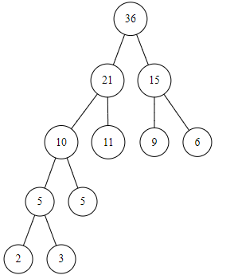

一、简答问题

1、四类数据结构名称及其关系图示。

2、为什么说数组和广义表是线性表的推广？

3、算法的定义与特性。

4、数据类型与抽象数据类型。

5、图遍历算法中设置访问标志数组的作用。

二、方法选择

1、快速排序方法的最坏最好情况是什么，简要分析说明理由。

2、二叉排序树中结点各不相同，欲得到一个由大到小的结点值递减序列，你认
为应当采用什么方法，便可得到要求结果，简述原因。

三、构造结果

1、给定叶结点权值：（2，3，5，6，9，11），构造哈夫曼树，并计算其带权路径
长度。

​	

2、已知一二叉树中序序列 `BDCAEF`，前序序列 `ABCDEF`，给出其对应的二叉树。

3、已知二维数组 `A[M][N]`采用行序为主方式存储，每个元素占 K 个存储单元，
已知 `A[1][1]`（设起始下标为 1）的存储地址是 100，给出 `A[i][j]`的存储地址算式。

4、在地址空间 0—12 的散列区中，对以下关键字序列：
（`Jan，Feb，Apr，May，Jun，Jul，Aug，Sep，Oct`）建哈希表，设哈希函数为`H(X)=i/2`，其中 i 为关键字中的第一个字母在字母表中的序号，处理冲突可选用线性探测法或链地址法之一，要求构造哈希表，并求出在等概率的情况下查找成功与不成功的平均查找长度。

5、给出求 N 阶 `hanoi` 塔的函数定义如下：

```
hanoi( int n, char x, char y, char z )
{
	if ( n == 1 )
		move( x, 1, z );
	else{
		hanoi( n - 1, x, z, y )
		move( x, n, z );
		hanoi( n - 1, y, x, z );
	}
}
```

请写出执行 `hanoi(3,a,b,c)` 时递归函数的实在参量变化及 move 的搬动过程。

四、编写算法

1、编写建立二叉树算法，要求二叉树按照二叉链表方式存储。

2、已知二叉树采用二叉链表存储，要求编写算法，完成计算出二叉树中度为 0、
度为 1 的结点数目。

五、编写程序

要求实现如下功能：

1、键盘输入 N 个有序整数，建立数组存储；

2、输入关键字 key，完成折半查找的功能。

六、编写算法

已知二叉树采用二叉链表存储，编写算法实现按层次遍历二叉树。


