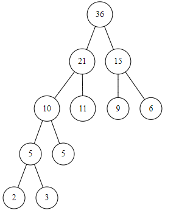
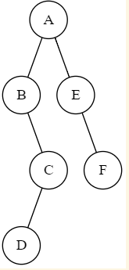

一、简答问题

1、四类数据结构名称及其关系图示。

>集合 线性结构 树形结构 图状结构或网状结构

2、为什么说数组和广义表是线性表的推广？

>数组与广义表可看作是一种扩展的线性数据结构，
其特殊性不像栈与队列那样反映在对数据元素的
操作受限方面，而是反映在数据元素的构成上。

3、算法的定义与特性。

>算法是规则的有限集合，是为解决特定问题而规定的
一系列操作。1 有限性 2 确定性 3 可行性 4 输入：有多个
或0个输入 5 输出：至少有一个或多个输出。

4、数据类型与抽象数据类型。

>数据类型是一组性质相同的值集合，以及定义在这个值集
合上的一组操作的总称。
抽象数据类型定义了一个数据对象，数据对象中各
元素间的结构关系以及一组处理数据的操作。

5、图遍历算法中设置访问标志数组的作用。

>为了保证图中的各顶点在遍历过程访问且仅访问一次
需要求每个顶点设一个访问标志，因此要为图设置一个
访问标志数组，用于标示图中每个顶点是否被访问过。

二、方法选择

1、快速排序方法的最坏最好情况是什么，简要分析说明理由。

>(1) 快速排序的最好情况是每趟将序列一分两半，正
>好在表中间，将表分成两个大小相等的子表，类似于折
>半查找，其时间复杂度为O(nlog<sub>2</sub>n)
>
>(2)快速排序的最坏情况是已经排好
>序，第一趟经过n-1次比较，第一个记录定在原位置，左
>部子表为空表，右部子表为n-1个记录。其比较次数为n<sup>2</sup>/2 O(n<sup>2</sup>)

2、二叉排序树中结点各不相同，欲得到一个由大到小的结点值递减序列，你认为应当采用什么方法，便可得到要求结果，简述原因。

>根据逆中序定义（RDL),先中序遍历右子树，访问根结点
>再中序遍历左子树，可以得出二叉排序树的一个重要性质，
>即逆中序遍历一个二又排序树可以得到一个递减有序序列。

三、构造结果

1、给定叶结点权值：（2，3，5，6，9，11），构造哈夫曼树，并计算其带权路径长度。

​	
>带权路径长度为: `WPL=2*4+3*4+5*3+11*2+9*2+6*2=8+12+15+22+18+12=87`

2、已知一二叉树中序序列 `BDCAEF`，前序序列 `ABCDEF`，给出其对应的二叉树。
>root: A  A左边BDC A右边EF  
root: B  B右边为DC  
root: C  C左边为D  
root: D  
root: E E的右边为F  
root: F



3、已知二维数组 `A[M][N]`采用行序为主方式存储，每个元素占 K 个存储单元，
已知 `A[1][1]`（设起始下标为 1）的存储地址是 100，给出 `A[i][j]`的存储地址算式。
>`LOC(A[i][j])=100+[N*(i-1)+j-1]*K`

4、在地址空间 0—12 的散列区中，对以下关键字序列：
（`Jan，Feb，Apr，May，Jun，Jul，Aug，Sep，Oct`）建哈希表，设哈希函数为`H(X)=i/2`，其中 i 为关键字中的第一个字母在字母表中的序号，处理冲突可选用线性探测法或链地址法之一，要求构造哈希表，并求出在等概率的情况下查找成功与不成功的平均查找长度。

| 散列区       | 0    | 1    | 2    | 3    | 4    | 5    | 6    | 7    | 8    | 9    | 10   | 11   | 12   | 13   |
| ------------ | ---- | ---- | ---- | ---- | ---- | ---- | ---- | ---- | ---- | ---- | ---- | ---- | ---- | ---- |
| 关键字       | Apr  | Aug  |      | Feb  |      | Jan  | May  | Jun  | Jul  | Sep  | Oct  |      |      |      |
| 成功比较次数 | 1    | 2    |      | 1    |      | 1    | 1    | 3    | 4    | 1    | 4    |      |      |      |
| 失败比较次数 | 3    | 2    | 1    | 2    | 1    | 7    | 6    | 5    | 4    | 3    | 2    | 1    | 1    | 1    |

>ASL(成功)=(1+2+1+1+1+3+4+1+4)/9=2
>
>ASL(不成功)=(3+2+1+2+1+7+6+5+4+3+2+1+1+1)/14=39/14

5、给出求 N 阶 `hanoi` 塔的函数定义如下：

```
hanoi( int n, char x, char y, char z )
{
	if ( n == 1 )
		move( x, 1, z );
	else{
		hanoi( n - 1, x, z, y )
		move( x, n, z );
		hanoi( n - 1, y, x, z );
	}
}
```
>执行过程如下:
```
hanod(3,a,b,c)
	hanoi(2,a,c,b)
		hanoi(1,a,b,c)
			move(a,1,c)
		move(a,2,b)
		hanoi(1,c,a,b)
			move(c,1,b)
	move(a,3,c)
	hanoi(2,b,a,c)
		hanoi(1,b,c,a)
			move(b,1,a)
		move(b,2,c)
		hanoi(1,a,b,c)
			move(a,1,c)
```

请写出执行 `hanoi(3,a,b,c)` 时递归函数的实在参量变化及 move 的搬动过程。

四、编写算法

1、编写建立二叉树算法，要求二叉树按照二叉链表方式存储。

2、已知二叉树采用二叉链表存储，要求编写算法，完成计算出二叉树中度为 0、
度为 1 的结点数目。

五、编写程序

要求实现如下功能：

1、键盘输入 N 个有序整数，建立数组存储；

2、输入关键字 key，完成折半查找的功能。

六、编写算法

已知二叉树采用二叉链表存储，编写算法实现按层次遍历二叉树。


