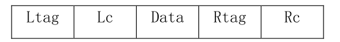
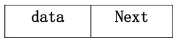

一、简答问题

1、简述数组、广义表属于线性表原因。

2、算法特性与算法时间复杂度。

3、线性结构与非线性结构的差别。

4、图遍历中设置访问标志数组的作用。

5、数据类型的含义与作用。

二、方法选择

1、只想得到 N 个元素序列中第 K 个最大元素之前的部分递减有序序列（`K<<N`）,列出 2 种速度快的方法名称与原因。

2、在数轴上有 n 个彼此不交的相邻区间，每个区间下、上界都是整数，按区间
位置从左到右依次编号为 1—N。试问：要查找某个给定值 x 所在区间，你认为
应选择什么方法查找最快，简述原因。

三、写出要求结果

1、已知计算阿克曼递归函数定义如下：

```
akm(int m, int n)
{
    if (m == 0)
        return (n + 1);
    else if (n == 0)
        return (akm(m - 1, 1));
    else
        return (akm(m - 1, akm(m, n - 1)));
}
```
请给出执行 akm(2,1)时，递归调用顺序及执行结果。

2、已知关键字序列为：（75，33，52，41，12，88，66，27）哈希表长为 10，哈希函数为：H(K)=K MOD 7，解决冲突用线性探测再散列法，要求构造哈希表，并求出等概率下查找成功与不成功的平均查找长度。

3、给定权值{8，12，4，5，26，16，9}，构造一棵哈夫曼树，并计算其带权路径长度。

4、在中序线索树中，要找出 X 结点的前驱结点，请写出相关函数定义。


5、已知一棵二叉树，其中序序列 BDAEC，后序序列 DBECA，构造该二叉树。

四、编写算法

要求实现在链式存储方式下的模式匹配。
已知主串 s 和子串 t 分别以单链表存储，t 和 s 中每个字符均用一结点表示
（如图）




即求：子串 t 在主串 s 中第一次出现的位置指针。

五、编写算法

（1）要求二叉树按二叉链表存储，写建立一棵二叉树的算法。

（2）编写输出二叉树中的非叶子结点的算法

六、编写算法

已知有 N 个结点的无向图，采用邻接表结构存储，要求编写算法实现广度优
先搜索策略遍历图中所有顶点