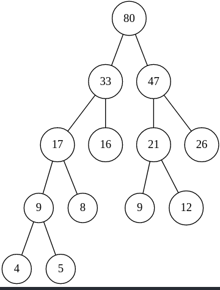
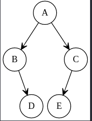

一、简答问题

1、简述数组、广义表属于线性表原因。

>数组与广义表可看作是一种扩展的线性数据结构，其特
>殊性不像栈与队列那样反映在对数据元素的操作受限
>方面，而是反映在数据元素的构成上。数组可看成是由具
>有某种结构的数据构成的，广义表则是由单个元素或子
>表构成的。

2、算法特性与算法时间复杂度。

>（1）有限性（2）确定性（3）可行性（4）有多个或0个输入（5）至少一个或多个输出
>算法的时间复杂度T(n)是该算法的时间度量，记作.
>T(n)=O(f(n))
>它表示随问题规模n的增大，算法的执行时间的增长率
>和f(n)的增长率相同，称作算法的渐近时间复杂度，
>简称时间复杂度。

3、线性结构与非线性结构的差别。

>线性结构中结点间具有唯一前驱、唯一后继关系，而非线
>性结构中结点间前驱、后继的关系并不具有唯一性。

4、图遍历中设置访问标志数组的作用。

>为了保证图中的各顶点在遍历过程中访问且仅访问一次，
>需要为每个顶点设一个访问标志，因此要为图中设置一个
>访问标志数组，用于标志图中每个顶点是否被访问过。

5、数据类型的含义与作用。

>数据类型是一组性质相同的值集合以及定义在这个值
>集合上的一组操作的总称。

二、方法选择

1、只想得到 N 个元素序列中第 K 个最大元素之前的部分递减有序序列（`K<<N`）,列出 2 种速度快的方法名称与原因。

>总的思路是尽量避免对所有N个元素排序。
>
>从而提高算法的速度。因为对N个元素进行快速排序、堆排序或归并排序，（平均）时间复杂度均为O(Nlog<sub>2</sub>N)
>
>所以，所谓速度快的方法，时间复杂度应该更低。
>
>简单选择排序，依次选出最大的K个元素，时间复杂度O(KN)。由于K远小于N，特别是当K<plog<sub>2</sub>N时
>
>（其中p为某个常数），该算法要比对整个序列排序的方法更快。
>
>
>
>堆排序，首先调整N个元素为大顶堆，然后输出堆顶最大元素，此后通过筛选可以依次求得其余
>
>K-1个最大元素，从而得到最大的K个元素。因为，建堆过程的比较次数不超过4N，每次筛选所需的比较
>
>次数不超过2logN，故总的时间复杂度为O(N+KlogN)。
>
>

2、在数轴上有 n 个彼此不交的相邻区间，每个区间下、上界都是整数，按区间
位置从左到右依次编号为 1—N。试问：要查找某个给定值 x 所在区间，你认为
应选择什么方法查找最快，简述原因。

>折半查找法，因为待查找序列按顺序存储，且大小有序排刻，
>而折半查找法比较次数少，查找速度快，平均性能好，适用于
>有序列表的这种情况。

三、写出要求结果

1、已知计算阿克曼递归函数定义如下：

```
akm(int m, int n)
{
    if (m == 0)
        return (n + 1);
    else if (n == 0)
        return (akm(m - 1, 1));
    else
        return (akm(m - 1, akm(m, n - 1)));
}
```
请给出执行 `akm(2,1)`时，递归调用顺序及执行结果。

>执行顺序和执行结果如下:
```c++
akm(2,1)
akm(1,akm(2,0))
akm(1,akm(1,1))
akm(1,akm(0,akm(1,0)))
akm(1,akm(0,akm(0,1)))
akm(1,akm(0,2))
akm(1,3)
akm(0,akm(1,2))
akm(0,akm(0,akm(1,1)))
akm(0,akm(0,akm(0,akm(1,0))))
akm(0,akm(0,akm(0,akm(0,1))))
akm(0,akm(0,akm(0,2)))
akm(0,akm(0,3))
akm(0,4)
return 5
```

2、已知关键字序列为：（75，33，52，41，12，88，66，27）哈希表长为 10，哈希函数为：H(K)=K MOD 7，解决冲突用线性探测再散列法，要求构造哈希表，并求出等概率下查找成功与不成功的平均查找长度。

| 散列区       | 0    | 1    | 2    | 3    | 4    | 5    | 6    | 7    | 8    | 9    |
| ------------ | ---- | ---- | ---- | ---- | ---- | ---- | ---- | ---- | ---- | ---- |
| 关键字       | 27   |      |      | 52   | 88   | 75   | 33   | 41   | 12   | 66   |
| 成功比较次数 | 5    |      |      | 1    | 1    | 1    | 2    | 2    | 4    | 7    |
| 失败比较次数 | 2    | 1    | 1    | 9    | 8    | 7    | 6    |      |      |      |

> `ASL(成功)=(5+1+1+1+2+2+4+7)/8=23/8`
>
> `ASL(失败)=(2+1+1+9+8+7+6)/7=34/7`


3、给定权值{8，12，4，5，26，16，9}，构造一棵哈夫曼树，并计算其带权路径长度。



>`WPL=(4+5)*4+(8+9+12)*3+(16+26)*2=36+87+84=207`

4、在中序线索树中，要找出 X 结点的前驱结点，请写出相关函数定义。


```c++
ThreadNode *InPre(ThreadNode *p)
{
    ThreadNode *pre, *q;
    if (p->Ltag == 1)
        pre = p->Lc;
    else
    {
        for (q = p->Lc; q->Rtag == 0; q = q->Rc)
        pre = q;
    }
    return pre;
}
```

5、已知一棵二叉树，其中序序列 `BDAEC`，后序序列 `DBECA`，构造该二叉树。

>root: A  A的左面是BD 右面是EC

>root: C A的右面连C C的左面连E

>root: B A的左面是B B的右面是D

>如下图:



四、编写算法

要求实现在链式存储方式下的模式匹配。
已知主串 s 和子串 t 分别以单链表存储，t 和 s 中每个字符均用一结点表示
（如图）


即求：子串 t 在主串 s 中第一次出现的位置指针。

五、编写算法

（1）要求二叉树按二叉链表存储，写建立一棵二叉树的算法。

（2）编写输出二叉树中的非叶子结点的算法

六、编写算法

已知有 N 个结点的无向图，采用邻接表结构存储，要求编写算法实现广度优

先搜索策略遍历图中所有顶点