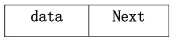

一、简答问题

1、线性结构与非线性结构的差别。

2、说明在图的遍历中，设置访问标志数组的作用。

3、简述数组和字符串属于线性表的原因。

4、算法特性与算法时间复杂度。

5、数据类型与抽象数据类型。

6、简述稳定排序含义，给出一种不稳定排序方法名称并证明。

二、方法选择

1、设有 10000 个无序元素，要求找出前 30 个最大元素，在下列排序方法（归并
排序、基数排序、快速排序、堆排序、插入排序）中哪些方法最好，为什么？

2、在一个待排序的序列中，只有很少量元素不在自己最终的正确位置上，但离
他们的正确位置都不远，简述应使用哪种排序方法最好。

三、构造结果：

1、给定叶结点权值：（3，4，5，6，7，8，9），构造哈夫曼树，并计算其带权路
径长度。

2、已知一二叉树中序序列为 BDCAEF，前序序列为 ABCDEF，给出其对应的二叉树。

3、已知二维数组 A[100][200]采用行序为主方式存储，每个元素占 K 个存储单
元，已知 A[0][0]的存储地址是 1500，给出 A[60][80]的存储地址。

4、给出 12 个结点的折半判定树，并计算其在等概率情况下的平均查找长度。

5、在地址空间 0—12 的散列区中，对以下关键字序列：（Jan，Feb，Apr，May，
Jun，Jul，Aug，Sep，Oct）建哈希表，设哈希函数为 H(X)=i/2，其中 i 为关键
字中的第一个字母在字母表中的序号，处理冲突可选用线性探测法或链地址法之
一，要求构造哈希表，并求出在等概率的情况下查找成功与不成功的平均查找长
度。

四、编写算法

设主串 s 和子串 t 分别以单链表存储，t 和 s 中的每个字符均用一结点表示
（如图）。

实现在链式存储方式下的模式匹配，即求子串 t 在主串 s 中第一次出现的位
置指针。

五、编写算法

已知二叉排序树按二叉链表形式存储，树中结点各不相同，欲得到一个由小
到大的结点值递增序列，编写算法达到要求结果。

六、编写算法

无向图采用邻接表方式存储，编写出广度优先遍历访问的算法。

七、编写语句

在前序线索树中要找出 X 结点的后继结点。

