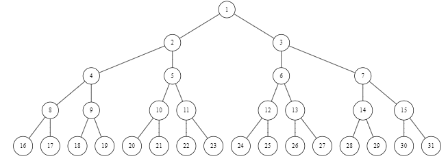
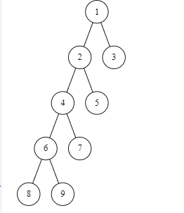

# 2014

## 一、简答

1、简述四类基本的数据逻辑关系，并用图表示。

> 集合 线性结构 树形结构 图状结构或网状结构.

2、特殊矩阵的压缩原则有哪些？

>(1) 元素分布有特殊规律的矩阵，寻找规律对应的数学
>公式，实现压缩存储。
>(2) 非零元素很少的稀疏矩阵，可采用只存储非零元素的
>方法实现压缩存储。

3、什么是平衡二叉排序树？平衡因子的取值范围是什么？

>平衡二又排序树（AVL树）一棵平衡二叉排序树或者
>是空树，或者是具有下列性质的二又排序树；①左子树与
>右子树的高度之差的绝对值小于等于1,②左子树和右
>子树也是平衡二又排序树。平衡因子的取值范围{-1,0,1}。

4、具有 n 个结点的 k 叉树，若采用 k 叉树链表存储，则空链域有多少个？（写
出求解步骤）。

> n个结点的k叉树共有n*k个指针，除根结点外已使用的
> 指针域为n-1，所以空指针的个数为：n(k-1)+1个.

5、递归进层时需要做哪些事？

>①保留本层参数与返回地址
>②为被调用函数的局部变量分配存储区，给下层参数赋值.
>③将程序转移到被调函数的入口。

## 二、分析与方法选择

1、在 10000 个元素中，欲找出 10 个最大的元素，采用哪些排序方法较好。简述
原因。

> 堆排序，因为堆排序一趟排序排定一个元素，只需进行前10趟排序就可以了，其它排序方法需进行完全排序，并且由于堆排序适用于K<<N的排序情况，所以堆排序较好O($n\log_{2}n$)

2、在一个连通无向图上，欲求顶点 $V_{i}$ 到顶点 $V_{j}$（$V_{i}$!=$V_{j}$）的最短简单路径，应采用深度优先遍历还是广度优先遍历？简述原因。

> 广度优先遍历、广度优先遍历按照广度方向搜索，能保证顶点$V_{i}$ 到顶点$V_{j}$之间所经路径最短。

3、分析冒泡排序的性能（最好情况、最坏情况）。

>最好情况 待排序列有序 时间复杂度O(n).空间复杂度 O(1).
>最坏情况 待排序列逆序 时间复杂度O($n^2$)空间复杂度O(1).

## 三、构造结果

1、已知一棵二叉树的前序遍历的结果是 `ABDCEGF`，中序遍历的结果是
`BDAEGCF`，试画出这课二叉树，并将其转换为相应的森林。

2、假设 T 是一棵高度为 5 的二叉树，T 中只有度为 0 和度为 2 的结点，给出：

（1）T 树可能的最大结点数，并画出这样的一棵二叉树。
>最大结点数为$2^5-1=31$个结点



（2）T 树可能的最小结点数，并画出这样的一棵二叉树。
>最小结点数为2*(5)-1=9



3、依次输入（26，30，15，10，28，19，18，22），构造二叉排序树，并计算
等概率情况下的查找成功的平均查找长度。

>3.3.gv
>`ASL=(1+2*2+3*3+2*4)/8=11/4`

4、画出 10 个元素的折半判定树，并计算等概率情况下查找成功的平均查找长
度。

>3.4.gv
>`ASL=(1+2*2+3*4+4*3)/10=2.9`

5、已知关键字集合：{50，52，85，22，96，17，36，55}，以第一个关键字中
轴元素，写出一趟快速排序的结果。

> 36  17 22 50 96 85 52 55

## 四、编写算法

1、编写算法 void Adjust(LinkList L)，其功能是：以第一个元素为基准，将小于该元素的结点全部放到前面，大于该元素的结点全部放到其后。

   ```c
    void Adjust(LinkList &L)
    {
        LinkNode *p1, *pre, *p, *q;
        if (L->next == NULL)
        {
            return ERROR;
        }
        p1 = L->next;
        pre = p1;
        p = p1->next;

        while (p)
        {
            q = p->next;
            if (p->data >= p1->data)
            {
                pre = p;
                p = q;
            }
            else
            {
                pre->next = p->next;
                p->next = L->next;
                L->next = p;
                p = q;
            }
        }
        return OK;
    }
   ```

2、要求循环队列不损失一个空间全部都能得到利用，设置一个标志域 tag，以
tag 为 0 或 1 来区分头尾指针相同时的列状态的空与满，请编写与此结构相应的出队算法。

   ```c
    int DeQueue(SqQueue &Q, ElemType &e)
    {
        if (Q.front == Q.rear && Q.tag == 0) //队空，报错
            return 0;
        e = Q.data[Q.front];
        Q.front = (Q.front + 1) % MaxSize;
        Q.tag = 0;
        return 1;
    }
   ```

3、二叉树采用二叉链表结构存储，编写算法实现统计二叉树中的结点个数。

```c
int count(BTNode *p){
    int n1,n2;
    if(p==NULL){
        return 0;
    }
    else{
        n1=count(p->lchild);
        n2=count(p->rchild);
        return n1+n2+1;
    }
}
```

## 五、编写算法

二叉树采用二叉链表结构存储，编写实现二叉树后序线索化的算法。

## 六、编写算法

编写算法，由依次输入的顶点数、弧数和各顶点信息、弧信息建立有向图的
邻接表存储结构.
