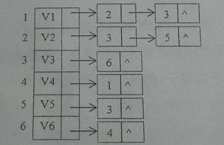
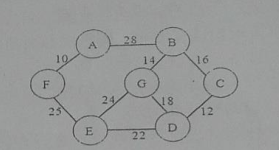

# 2015

## 一、 简答

1. 四种基本逻辑结构及其图示。

   > 集合 线性结构 树形结构 图状结构或网状结构.

2. 栈和队列为什么是限定性线性表？他们有什么不同？

   >栈和队列是两种重要的抽象数据类型，是一类操作受限的线性表，其特殊性在于限制了插入和删除的位置。
栈是将线性表的插入和删除操作限制为仅在表的一端进行,有后进先出的特性.
队列只允许在表的一端插入元素，而在另一端删除，有先进先出的特性。

3. 折半查找的前提是什么？

   >①待查序列必须采用顺序存储结构②必须按关键字大小有序排列。

4. 什么是平衡二叉排序树？平衡因子的取值范围有哪些？

   >平衡二又排序树（AVL树）一棵平衡二叉排序树或者
   >是空树，或者是具有下列性质的二又排序树；①左子树与
   >右子树的高度之差的绝对值小于等于1,②左子树和右
   >子树也是平衡二又排序树。平衡因子的取值范围{-1,0,1}。

5. 简述排序的稳定性，列举至少2个稳定的排序算法和两个不稳定排序算法。

>假设在待排序的序列中存在多个相同关键字的记录。设$K_{i}$=$K_{j}$($1<=i<=n,1<=j<=n,i!=j$),
>若在排序前的序列中$R_{i}$领先于$R_{j}$(即$i<j$),经过排序后得到的序列中$R_{i}$仍领先于$R_{j}$,则称
>
>所用的排序方法是稳定的。
>
>稳定排序算法: 直接插入排序 冒泡排序 归并排序 基数排序
>
>不稳定排序: 简单选择排序 希尔排序 快速排序 堆排序

## 二、 分析

1. 已知一棵完全二叉树共有550个结点，求解该二叉树上叶子结点、度为1的结点以及度为2的结点的个数。

   >完全二叉树 树高为h 则最多有$2^h-1$个结点  
   > $2^9-1=511$,则完全二叉树树高为10  
   >第10层有$550-511=（19×2）+1$个结点  
   >故度为1的结点的个数为1  
   >度为0（即叶子结点）的个数为$39+(2^8-19-1)=275$
   >度为2 的结点的个数为$550-1-275=274$

2. 一个图有n个顶点，e条边。分别采用邻接矩阵和邻接表存储时的空间复杂度。

   > 邻接矩阵: O($n^2$)
   > 邻接表: O($n+2e$)

3. 分析直接插入排序的最好情况和最坏情况性能。

> 最好情况: 元素有序  时间复杂度为O(n) 空间复杂度O(1)
>
> 最坏情况: 元素顺序与排序结果顺序相反(逆序) 时间复杂度为O($n^2$)  空间复杂度为O(1)

## 三、 构造结果

1.已知一棵树的先根遍历是ABEFCDG,后根遍历是FEGDCBA,试画出这棵树。
>3.1.gv

2.某有向图的邻接表存储结构如`图1`所示，请写出从A点出发的深度和广度遍历序列，以及深度和广度优先生成树。



>深度遍历序列： V1 V2 V3 V6 V4 V5
>广度遍历序列： V1 V2 V3 V5 V6 V4
>深度优先生成树 3.2.1.gv 与 广度优先生成树 3.2.2.gv

3.给定权值（5,7,10,12,18,20,28),构造哈夫曼树，并计算带权路径长度。

>3.3.gv
>`WPL=(5+7)*4+(10+12+18)*3+(20+28)*2=264`

4.最小生成树。用克鲁斯卡尔算法，构造如`图2`所示连通网的最小生成树（写出过程）。



5.依次输入关键字（39,34,85,22,96,17;36,55},构建二叉排序树，并计算等概率情况下的查找成功的平均查找长度。

>3.5.gv
>`ASL=(1*4+4*3+2*2+1*1)/8=21/8`

## 四、 编写算法

1.已知带头结点的单链表L,编写一个尽量高效的算法将L中的元素就地逆置。

```c
LinkList Reverse(LinkList L){
   LNode *p,*r;
   p=L->next;
   L->next=NULL;
   while(p!=NULL){
      r=p->next;
      p->next=L->next;
      L->next=p;
      p=r;
   }
   return L;
}
```

2.在中序线索树root采用如下结构存储，编写算法找出X结点的后继结点。


## 五、 编写算法

已知二叉树采用二叉链表存储，编写算法，判断其是否为完全二叉树。

```c
   bool isComplete(BiTree T)
   {
      InitQueue(Q);
      if (!T)
      {
         return true;
      }
      EnQueue(Q, T);
      while (!IsEmpty(Q))
      {
         DeQueue(Q, p);
         if (p)
         {
               EnQueue(Q, p->lchild);
               EnQueue(Q, p->rchild);
         }
         else
         {
               while (!IsEmpty(Q))
               {
                  DeQueue(Q, p);
                  if (p)
                  {
                     return false;
                  }
               }
         }
      }
      return true;
   }
```

## 六、 编写算法

编写算法void CreateHashTable(int ht[],int n),其功能是：依次输入n个整数，构造哈希表。哈希函数是除留余数法，处理冲突的方法采用线性探测再散列（假设表长是m,p是小于或等于m的最大质数）。
