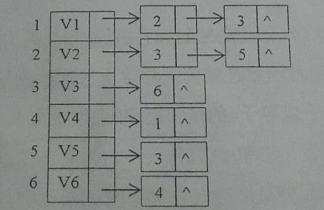
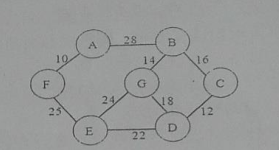
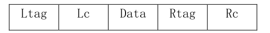

一、 简答

1. 四种基本逻辑结构及其图示。
2. 栈和队列为什么是限定性线性表？他们有什么不同？
3. 折半查找的前提是什么？
4. 什么是平衡二叉排序树？平衡因子的取值范围有哪些？
5. 简述排序的稳定性，列举至少2个稳定的排序算法和两个不稳定排序算法。

二、 分析

1. 已知一棵完全二叉树共有550个结点，求解该二叉树上叶子结点、度为1的结点以及度为2的结点的个数。
2. 一个图有n个顶点，e条边。分别采用邻接矩阵和邻接表存储时的空间复杂度。
3. 分析直接插入排序的最好情况和最坏情况性能。

三、 构造结果

1.已知一棵树的先根遍历是ABEFCDG,后根遍历是FEGDCBA,试画出这棵树。

2.某有向图的邻接表存储结构如`图1`所示，请写出从A点出发的深度和广度遍历序列，以及深度和广度优先生成树。

3.给定权值（5,7,10,12,18,20,28),构造哈夫曼树，并计算带权路径长度。

4.最小生成树。用克鲁斯卡尔算法，构造如`图2`所示连通网的最小生成树（写
出过程）。

5.依次输入关键字（39,34,85,22,96,17;36,55},构建二叉排序树，并计算等概率情况下的查找成功的平均查找长度。

四、 编写算法

1.已知带头结点的单链表L,编写一个尽量高效的算法将L中的元素就地逆置。

2.在中序线索树root采用如下结构存储，编写算法找出X结点的后继结点。

五、 编写算法

已知二叉树采用二叉链表存储，编写算法，判断其是否为完全二叉树。

六、 编写算法

编写算法void CreateHashTable(int ht[],int n),其功能是：依次输入n个整数，构造哈希表。哈希函数是除留余数法，处理冲突的方法采用线性探测再散列（假设表长是m,p是小于或等于m的最大质数）。