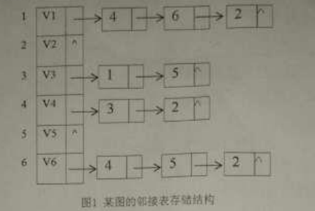

# 2016

## 一、简答

1. 栈、队列和字符串都是限定性线性表，它们各自有什么限定？

   >栈是将线性表的插入和删除操作限制为仅在表的一端行。
队列只允许在表的一端插入元素，而在另一端删除元素。
字符串是一种特定的线性表，其特殊性在于组成线性表的
每个元素就是一个单字符。

2. 折半查找的前提条件是什么？

   > ①待查序列必须采用顺序存储结构②必须按关键字大小有序排列。

3. 在图的遍历过程中，访问标志数组visited[]如何防止结点被遗漏访问和重复访问的？

   >标志访问数组的初值为0(假）,一旦顶点$V_{i}$访问过，则置visited [i] 为 1(真）,以表示该顶点已访问。

4. 简述排序的稳定性，列举至少2个稳定的排序算法和2个不稳定排序算法。

   >假设在待排序的序列中存在多个相同关键字的记录。设$K_{i}=K_{j}$($1<=i<=n,1<=j<=n,i!=j$),
   >若在排序前的序列中$R_{i}$领先于$R_{j}$(即$i<j$),经过排序后得到的序列中$R_{i}$仍领先于$R_{j}$,则称所用的排序方法是稳定的。
   >稳定排序算法: 直接插入排序 冒泡排序 归并排序 基数排序
   >不稳定排序: 简单选择排序 希尔排序 快速排序 堆排序

## 二、分析

1.若一个具有n个结点、k条边的非连通无向图是一个森林（n>k),则该森林包含多少棵树？

   >设该森林共有m棵树,每棵树有$n_{i}$($1<=n<=m$)个结点,
   >依据树的性质有:
   >$n=n_{1}+n_{2}+...+n_{m}$  
   >$k=(n_{1}-1)+(n_{2}-1)+...+(n_{m}-1)$  
   >上面两式相减得: $n-k=1+1+...+1=m$
   >而m就是树的个数,所以该森林共有$n-k$棵树

2.设有10000个待排序的记录关键字，如果需要用最快的方法选出其中最小的
10个记录关键字，则快速排序、简单选择排序、堆排序、直接插入排序、归并排序中，哪些排序方法效率较高，简要说明理由。

   >堆排序，因为堆排序一趟排序排定一个元素，只需进行
   >前10趟排序就可以了，其它排序方法需进行完全排序。

3.分析冒泡排序的最好情况和最坏情况性能。

   >最好情况 待排序列有序 时间复杂度O($n$),空间复杂度O(1)  
   >最坏情况 待排序列逆序  时间复杂度O($n^2$),空间复杂度O(1)

## 三、构造结果

1. 已知一棵二叉树的先序遍历是ABDEGCF,中序遍历是DBGEACF,试画出这棵
二叉树，并将其后序线索化。

   >3.1.gv

2. 给定权值（3,4,5,6,7,8,9},构建Huffman树，并计算其带权路径长度。

   >3.2.gv  
`WPL=(3+4)*4+(5+6+7)*3+(8+9)*2=116`

3. 图的邻接表存储结构如`图1`所示，基于该存储结构，写出从V1点出发的深度
遍历序列以及深度优先生成树，并给出该图的邻接矩阵存储方式。

   

   >深度遍历序列: V1 V4 V3 V5 V2 V6

4. 对以下关键字序列建立哈希表：(19,13,20,21,23,27,26,30),哈希
表长度为10,哈希函数为H(K)=关键字%7,用线性探测再散列解决冲突，计算在等
概率情况下查找成功和不成功的平均查找长度。

5. 已知关键字集合：(19,13.20.11,23,27,16,30},分别写出简单选
择排序和直接插入排序的前三趟排序结果。

## 四、编写算法

1. 某顺序表中的元素为整型，设第一个元素为key。编写尽可能高效的算法
将小于等于key的元素全部放在其前面，大于key的元素全部放在其后面。

   ```c
      int func(SqList &L){
         int temp;
         int i=0,j=L.length-1;
         temp=L.data[i];
         while(i<j){
            while(i<j&&L.data[j]>temp) --j;
            if(i<j){
               L.data[i]=L.data[j];
               ++i;
            }
            while(i<j&&L.data[i]<=temp) ++i;
            if(i<j){
               L.data[j]=L.data[i];
               --j;
            }    
         }
         L.data[i]=temp;
      }
   ```

2. 在二叉排序树中查找关键字为key的结点。若找到，返回该结点的地址：否
则返回NULL。

   ```c
   BSTree SearchBST(BSTree bst,KeyType key){
      if(!bst){
         return NULL;
      }
      else if(bst->key==key){
         return bst;
      }
      else if(bst->key>key){
         return SearchBST(bst->lchild,key);
      }
      else{
         return SearchBST(bst->rchild,key);
      }
   }
   ```

## 五、编写算法

对带头结点的单链表Head进行简单选择排序，排序后结点值从小到大排序。

## 六、编写算法

某有向图采用邻接表存储，编写算法输出该图的拓扑序列。
