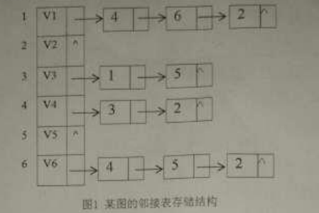

一、简答
1. 栈、队列和字符串都是限定性线性表，它们各自有什么限定？
2. 折半查找的前提条件是什么？
3. 在图的遍历过程中，访问标志数组visited[]如何防止结点被遗漏访问和重复访问的？
4. 简述排序的稳定性，列举至少2个稳定的排序算法和2个不稳定排序算法。

二、分析

1.若一个具有n个结点、k条边的非连通无向图是一个森林（n>k),则该森林包含多少棵树？

2.设有10000个待排序的记录关键字，如果需要用最快的方法选出其中最小的
10个记录关键字，则快速排序、简单选择排序、堆排序、直接插入排序、归并排序中，哪些排序方法效率较高，简要说明理由。

3.分析冒泡排序的最好情况和最坏情况性能。

三、构造结果

1.已知一棵二叉树的先序遍历是ABDEGCF,中序遍历是DBGEACF,试画出这棵
二叉树，并将其后序线索化。

2.给定权值（3,4,5,6,7,8,9},构建Huffman树，并计算其带权路径长度。

3.图的邻接表存储结构如`图1`所示，基于该存储结构，写出从V1点出发的深度
遍历序列以及深度优先生成树，并给出该图的邻接矩阵存储方式。

4.对以下关键字序列建立哈希表：(19,13,20,21,23,27,26,30),哈希
表长度为10,哈希函数为H(K)=关键字%7,用线性探测再散列解决冲突，计算在等
概率情况下查找成功和不成功的平均查找长度。

5.已知关键字集合：(19,13.20.11,23,27,16,30},分别写出简单选
择排序和直接插入排序的前三趟排序结果。

四、编写算法 

1.某顺序表中的元素为整型，设第一个元素为key。编写尽可能高效的算法
将小于等于key的元素全部放在其前面，大于key的元素全部放在其后面。

2.在二叉排序树中查找关键字为key的结点。若找到，返回该结点的地址：否
则返回NULL。

五、编写算法

对带头结点的单链表Head进行简单选择排序，排序后结点值从小到大排序。

六、编写算法

某有向图采用邻接表存储，编写算法输出该图的拓扑序列。