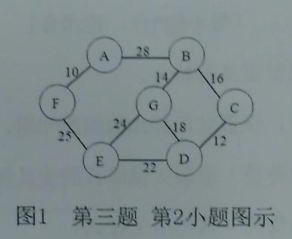

# 2017

## 一、简答

1.抽象数据类型定义与特点。

   >抽象数据类型定义了一个数据对象、数据对象中各元素间的结构关系以及一组处理数据的操作。最重要的特点是数据抽象与信息隐蔽。

2.图的遍历中，设置访问标志数组的作用。

   >为了保证图中的顶点在遍历过程中访问且仅访问一次，需要为每个顶点设一个访问标志，因此要为图设置一个访问
标志数组visited[i],用于标示图中每个顶点是否被访问过。

3.什么是关键路径？求解关键路径的意义何在？

   >从源点到汇点的最长路径的长度即为完成整个工程任务所需的时间，该路径称为关键路径。关键路径上的活动称
为关键活动。这些活动中的任意一项活动未能按期完成，
则整个工程的完成时间就要推迟，相反，如果能够加快关键活动的进度，则整个工程可以提前完成。

4.什么是哈夫曼树？其作用是什么？

   >哈夫曼树是由n个带权叶子结点构成的所有二叉树中带权
路径长度最短的二叉树，可用于哈夫曼编码，解决数据压缩等问题。

## 二、分析

1.已知一棵完全二叉树第6层有6个叶子结点，该二叉树最多有多少
个结点？最少有多少个结点？给出简单分析过程。

   >最少情况：第六层只有6个叶子结点 其他都为空 则共有$2^5-1+6=37$个结点。
   >最多情况：第六层最右边的6个结点没有孩子(即叶子结点) 其他结点都有孩子
 则共有$2^6-1+(2^5-6)*2=63+52=115$个节点

2.一个图有n个顶点，e条边。分析采用邻接矩阵和邻接表存储时所
需要的存储空间。

   >邻接矩阵： $n^2$  邻接表: $n+2e$

3.设有10000个待排序的记录关键字，需要用最快的方法选出其中最小的10个记录关键字，则快速排序、简单选择排序、堆排序、直接插入排序、归并排序中，哪些排序方法效率较高，简要说明理由。还有哪些适合该要求的高效排序方法？

   >(1)堆排序，一次排定一个元素，进行10趟排序即可，无需完全排序。  
   >(2)简单树形排序，同理。

## 三、构造结果

1.N阶对称矩阵A,压缩存储在一维数组B中。假设存储下三角矩阵，
请分析对于A[i,j],其在B中的存储位置的下标。（下标从1开始）

>`LOC(A[i][j])=LOC(A[1][1])+[i*(i-1)/2+j-1]*size`

2.用克鲁斯卡尔算法，构造如`图1`所示连通网的最小生成树（写出每步结果）。



>

3.画出11个结点的折半判定树，并计算等概率情况下的查找成功的
平均查找长度。

4.某报文长度为60个字符，统计发现共含6种字符，其出现的次数
分别为（5,1,3,6,8,21,16)。要求①为该报文设计一种编码，使其报文长
度最短；②计算编码后的报文长度。

5.对关键字序列（25,18,45,40,26,22,16,10}按从小到大排序，①写
出1趟快速排序的结果；②写出用堆排序时建立的初堆。

## 四、编写算法

1.已知带头结点的单链表L,编写算法删除值最大的结点。

   ```c
   LinkList DeleteMax(LinkList &L)
   {
      LinkNode *pre = L, *p = pre->next;
      LinkNode *maxPre = pre, *maxP = p;
      while (p != NULL)
      {
         if (p->data > maxP->data)
         {
               maxP = p;
               maxPre = pre;
         }
         pre = p;
         p = p->next;
      }
      maxPre->next = maxP->next;
      free(maxP);
      return L;
   }
   ```

2.二叉树采用二叉链表方式存储，编写算法实现二叉树的层次遍历。

   ```c
   void LevelOrder(BiTree T)
   {
      LinkQueue Q;
      InitQueue(Q); //初始化辅助队列
      BiTree p;
      EnQueue(Q, T); //将根结点入队
      while (!IsEmpty(Q))
      {                  //队列不空则循环
         DeQueue(Q, p); //队头结点出队
         visit(p);      //访问出队结点
         if (p->lchild != NULL)
               EnQueue(Q, p->lchild); //左孩子入队
         if (p->rchild != NULL)
               EnQueue(Q, p->rchild); //右孩子入队
      }
   }
   ```

## 五、编写算法

一棵二叉树采用二叉链表方式存储，编写算法判断给定的这棵二叉
树是否为二叉排序树。

```c
KeyType predt=-32767
int JudgeBST(BiTree bt){
   int b1,b2;
   if(bt==NULL){
      return 1;
   }
   else{
      b1=JudgeBST(bt->lchild);
      if(b1==0||predt>=bt->data){
         return 0;
      }
      predt=bt->data
      b2=JudgeBST(bt->rchild);
      return b2;
   }
}
```

## 六、编写算法

某关键字序列按除留余数法构建了哈希表，H(key)=key%P(P小
于等于m),采用线性探测再散列解决冲突。编写算法，对给定长度为m、
元素个数为n的哈希表（m大于等于n),计算等概率情况下查找成功的
平均查找长度。

```c
NULLKEY=-1
DELKEY=-2
void CompASL(HashTable ha,int m){
   int s=0,n=0;
   for(int i=0;i<m;i++){
      if(ha[i].key!=DELKEY&&ha[i].key!=NULLKEY){
         s+=ha[i].count;
         n++;
      }
   }
   return (s/n);
}
```
