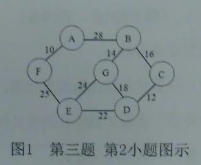

一、简答

1.抽象数据类型定义与特点。

2.图的遍历中，设置访问标志数组的作用。

3.什么是关键路径？求解关键路径的意义何在？

4.什么是哈夫曼树？其作用是什么？

二、分析

1.已知一棵完全二叉树第6层有6个叶子结点，该二叉树最多有多少
个结点？最少有多少个结点？给出简单分析过程。

2.一个图有n个顶点，e条边。分析采用邻接矩阵和邻接表存储时所
需要的存储空间。

3.设有10000个待排序的记录关键字，需要用最快的方法选出其中最小
的10个记录关键字，则快速排序、简单选择排序、堆排序、直接插入排序、
归并排序中，哪些排序方法效率较高，简要说明理由。还有哪些适合该要求
的高效排序方法？

三、构造结果

1.N阶对称矩阵A,压缩存储在一维数组B中。假设存储下三角矩阵，
请分析对于A[i,j],其在B中的存储位置的下标。（下标从1开始）

2.用克鲁斯卡尔算法，构造如`图1`所示连通网的最小生成树（写出
每步结果）。

3.画出11个结点的折半判定树，并计算等概率情况下的查找成功的
平均查找长度。

4.某报文长度为60个字符，统计发现共含6种字符，其出现的次数
分别为（5,1,3,6,8,21,16)。要求①为该报文设计一种编码，使其报文长
度最短；②计算编码后的报文长度。

5.对关键字序列（25,18,45,40,26,22,16,10}按从小到大排序，①写
出1趟快速排序的结果；②写出用堆排序时建立的初堆。

四、编写算法

1.已知带头结点的单链表L,编写算法删除值最大的结点。

2.二叉树采用二叉链表方式存储，编写算法实现二叉树的层次遍历。

五、编写算法

一棵二叉树采用二叉链表方式存储，编写算法判断给定的这棵二叉
树是否为二叉排序树。

六、编写算法：

某关键字序列按除留余数法构建了哈希表，H(key)=key%P(P小
于等于m),采用线性探测再散列解决冲突。编写算法，对给定长度为m、
元素个数为n的哈希表（m大于等于n),计算等概率情况下查找成功的
平均查找长度。
