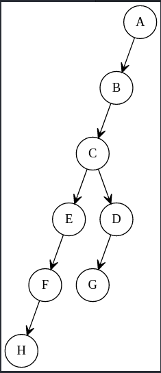
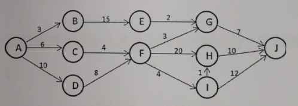

#### 一、简答

1. 栈、队列和字符串都是限定性线性表，它们各自有什么限定？

>栈是将线性表的插入和删除操作限制为仅在表的一端进行。  
队列只允许在表的一端插入元素，而在另一端删除元素。  
字符串是一种特定的线性表，其特殊性在于组成线性表的
每个元素就是一个单字符。

2. 利用哈夫曼树进行编码，如何能保证编码是最优前缀码？

>由于哈夫曼编码对应叶权为各字符使用频度的哈夫曼树，
>因此，该树为带权长度最小的树，即
>$$
>\sum_{i=1}^{n}{W_iP_i}
>$$
>最小，这正是度量报文平均长度的式子，因此可以证明哈夫曼编码是最优前缀编码。

3. n个顶点e条边的无向图，采用邻接矩阵和邻接表分别占用多少
   个存储单元？

> 邻接矩阵: n2  邻接表: `n+2e`

4. 快速排序在什么情况下性能最差？如何对最坏情况进行改进？

>快速排序的最坏情况是已经排好序，为避免枢轴元素是最大值或最小值，
>
>可采用三元素值取中间元素值的方法来选取。或随机选取某个元素作为枢轴元素。

#### 二、分析

1.某单链表，能否遍历一遍找到中间结点且空间复杂度为O(1)?
简述原因。

> 能设置两个指针，一个每次移动两个位置，一个每次移动一个位置，
>
> 当第一个指针到达尾结点时,第二个指针就到达了中间位置。

2.二叉树采用二叉链表存放，要求返回后序遍历序列中的第一个
结点指针，可否不用栈也不用递归完成？简述原因。

> 可以，后续遍历的顺序是"左子树-右子树-根结点"，因此，二叉树
>
> 最左下的叶子结点是后续遍历序列中的第一个结点。

3.从比较和移动次数上，分析冒泡排序的最好和最坏情况性能。

> 最好情况: 比较次数 N-1,移动次数 0              O(n)
>
> 最坏情况: 比较次数 `N*(N-1)/2`,移动次数  `3N*(N-1)/2`  O(n2)            

#### 三、构造结果

1.已知一棵树的先根遍历是`ABCEFHDG`,后根遍历是`HFEGDCBA`,试  
画出这棵树，并给出其双亲表示法。

> 3.1.gv

2.已知对称矩阵`A[5][5]`(下标从1到5),采用行序为主序存储其下
三角（包括对角线）元素，将其存储在一维数组B中。已知B的起始地址为
1000,且每个元素占4个字节。完成：

(1)写出A中元素`A[i][j]`在B中的存储地址映射公式。

> `LOC(A[i][j])=LOC(A[1][1])+[i*(i-1)/2+j-1]*size=1000+[i*(i-1)/2+j-1]*4`

(2)计算`A[2][5]`和`A[3][1]`的存储地址。

> `LOC(A[2][5])=1000+5*4=1020`
>
> `LOC(A[3][1])=1000+3*4=1012`

3.求出下图的关键路径。

4.设哈希函数为H(K)=K MOD 7,K为关键字，用线性探测再散列
法处理冲突。输入关键字序列：(32,31,30,46,40,63)完成：

(1)构造装填因子为0.6的Hash表；

(2)计算等概率情况下的查找成功和不成功的平均查找长度。

5.采用折半查找对列表进行查找（12,13,15,36,42,63,66,78,90),完成：

(1)构造其折半判定树；

(2)若查找15,需要和哪些元素进行比较？

(3)计算等概率情况下查找成功和不成功的平均查找长度。

6.对关键字集合（29,13,20,41,23,27,16,70}从小到大排序，
分别写出三趟堆排序和直接插入排序的排序结果。

#### 四、编写算法

1.从尾到头打印单链表，要求不改变该链表顺序，算法尽可能高效。

2.利用栈的基本操作，判断给定的字符串是否为回文串。

3.已知树采用孩子-兄弟链存储，编写算法求该树的高度。

#### 五、编写算法

某二叉树采用二叉链表存储，判断该二叉树是否是完全二叉树。

#### 六、编写算法

已知一个无向连通图G,采用邻接表存储。求从`Vi`出发到`Vj`(`Vi`不
等于`Vj`,)所经结点数目最少的路径。