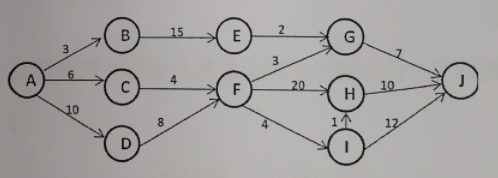

一、简答

1.栈、队列和字符串都是限定性线性表，它们各自有什么限定？

2.利用哈夫曼树进行编码，如何能保证编码是最优前缀码？

3.n个顶点e条边的无向图，采用邻接矩阵和邻接表分别占用多少
个存储单元？

4.快速排序在什么情况下性能最差？如何对最坏情况进行改进？

二、分析

1.某单链表，能否遍历一遍找到中间结点且空间复杂度为0(1)?
简述原因。

2.二叉树采用二叉链表存放，要求返回后序遍历序列中的第一个
结点指针，可否不用栈也不用递归完成？简述原因。

3.从比较和移动次数上，分析冒泡排序的最好和最坏情况性能。

三、构造结果

1.已知一棵树的先根遍历是ABCEFHDG,后根遍历是HFEGDCBA,试
画出这棵树，并给出其双亲表示法。

2.已知对称矩阵`A[5][5]`(下标从1到5),采用行序为主序存储其下
三角（包括对角线）元素，将其存储在一维数组B中。已知B的起始地址为
1000,且每个元素占4个字节。完成：

(1)写出A中元素A[i][j]在B中的存储地址映射公式。

(2)计算A[2][5]和A[3][1]的存储地址。

3.求出下图的关键路径。

4.设哈希函数为H(K)=K MOD 7,K为关键字，用线性探测再散列
法处理冲突。输入关键字序列：(32,31,30,46,40,63)完成：

(1)构造装填因子为0.6的Hash表；

(2)计算等概率情况下的查找成功和不成功的平均查找长度。

5.采用折半查找对列表进行查找（12,13,15,36,42,63,66,78,90),完成：

(1)构造其折半判定树；

(2)若查找15,需要和哪些元素进行比较？

(3)计算等概率情况下查找成功和不成功的平均查找长度。

6.对关键字集合（29,13,20,41,23,27,16,70}从小到大排序，
分别写出三趟堆排序和直接插入排序的排序结果。

四、编写算法

1.从尾到头打印单链表，要求不改变该链表顺序，算法尽可能高效。

2.利用栈的基本操作，判断给定的字符串是否为回文串。

3.已知树采用孩子-兄弟链存储，编写算法求该树的高度。

五、编写算法

某二叉树采用二叉链表存储，判断该二叉树是否是完全二叉树。

六、编写算法

已知一个无向连通图G,采用邻接表存储。求从Vi出发到Vj(Vi不
等于Vj,)所经结点数目最少的路径。