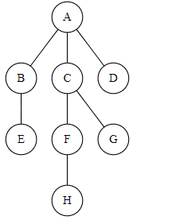

一、简答

1.顺序队列的假溢出现象及解决方法.

2.折半查找的前提条件.

3.分析简单选择排序的稳定性（若稳定则证明之，
若不稳定则举出反例）

4.几个顶点e条边的无向图，采用邻接矩阵和邻接表
分别占用多少存储单元？

二、分析

1.一棵完全二叉树上有165个结点，求解该二叉树上
中度为0、1、2的结点个数。

2、N个元素的集合中，如何快速找到第k小的元素？
(写出你的分析过程）

3.求时间复杂度。（并写出分析过程）

```
void func(int n)
{
    int i = 0, s = 0;
    while (s < n)
    {
        i++;
        s = s + i;
    }
}
```

三、构造结果
1、把一个三角矩阵A[N][N]中的元素效入到数中
其中A[i][j]在数组中的下标k为多少？

2.一棵树的前根序列为ABCEFHDG,后根序列为
HFEGDCBA,试画出这棵树。

3.写出调用过程和调用结果fun(6)
```
fun(int n)
{
    switch (n)
    {
    case 0:
    case 1:
    case 2:
        1;
        break;
    }

    return (fun(n - 1) + fun(n - 2));
}
```

4.考的哈希函数设哈希函数为1+(key)=key%P哈希表的长度为10.采用线性
探测再散列来处理冲突，给定关键序列为（这个不记得了）

(1)选定一个合适的P值并构造哈希表

(2)求在等概率下查找成功和不成功的平均长度

5.考的排序（具体结出的例子为(50，52，85，96，22，17，36，55)

(1)以第一个元素为关键字、快速排序（从小到大）

(2)考堆排序（大根堆）

四、编写程序

1.在一个顺序表L中，编写算法删除所有值介子x和y之间的所有无素.(x<=y.要求算法尽可能高效）

2、二叉村采用二叉链表存储表示。编写算法求取一棵二叉树的路径长度。（二叉树的路径长度是指从树根到树中所有结点的路径长度之和，二又树中结点的路径长度为该结点所在的层次值-1,根结点为第1层，以此类推）

3.循环队列中，不损失单元而是增加一个tag来辅助区分队空和队满，写出在此结构下的出队和入队的操作。

五.编写程序

某树以孩子——兄弟链存储，编写算法按层次以（双亲、孩子）的形式输出树中所有的边.如右图，应输出



(A,B)(A,C)(A,D)(B,E)(C,F)(C,G)(F,H)

六、编写算法

已知一个无向边连通图G,采用邻接表存储。求从V<sub>i</sub>出发到V<sub>j</sub>(V<sub>i</sub>不等于V<sub>j</sub>)所经结点数目最少的路径。
